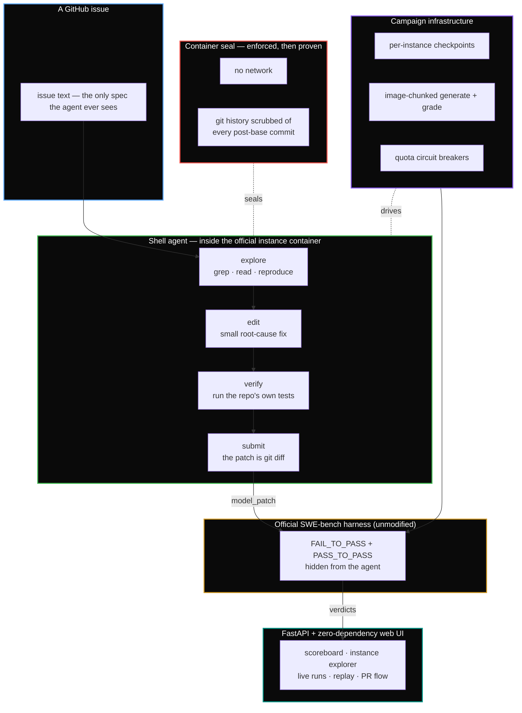

<div align="center">

# Fixpoint

**An autonomous agent that fixes real GitHub issues — benchmarked honestly, on free open-weight models.**

[](https://www.python.org/)
[](https://www.docker.com/)
[](https://fastapi.tiangolo.com/)
[](#results--proof)
[](#results--proof)
[](https://github.com/Sparshg3011/Fixpoint/actions)
[](LICENSE)

[Results](#results--proof) · [Architecture](#architecture) · [How it works](#how-it-works) · [Quick Start](#quick-start) · [Honest Scope](#honest-scope) · [Design Notes](#design-notes)

</div>

---

## About

Give Fixpoint a GitHub repository and an issue, and it finds the buggy code, writes a
patch, tests it, and opens a pull request on your fork. Under the hood it is a bash
agent working inside a sandboxed Docker container — it greps the codebase, edits
files, runs the project's own tests, and submits when its fix verifies.

**Every number below is graded by the unmodified official
[SWE-bench](https://www.swebench.com) harness** on real GitHub issues from twelve
Python projects (Django, sympy, scikit-learn, matplotlib, …). The agent never sees
the reference solutions or the graded tests — that firewall is enforced in code and
audited in CI, not promised in prose.

**Total inference cost of every result: $0.00.** The entire stack runs on free
open-weight model endpoints (NVIDIA NIM), from-scratch retrieval to final PR.

---

## Results & Proof

| result | benchmark | cost |
|:---|:---|:---|
| **47% resolved** — CI [38%, 57%] | SWE-bench Lite, n=100 stratified subset | **$0.00** |
| **32.7% resolved** — CI [28%, 38%] | SWE-bench Lite, all 300 instances | **$0.00** |

Both rows run Nemotron-3-Ultra via NVIDIA NIM's free tier — **47% sits in the
range of the best open-weight entry on the official Lite leaderboard, at zero
inference cost.**

The number wasn't found, it was *built*: 37% → 44% → 47% on identical
instances, one measured change at a time, including two published negative
results. The complete architecture ladder lives in
[docs/RESULTS.md](docs/RESULTS.md).

**What makes these numbers defensible:**

- **Official harness, unmodified** — grading is a byte-identical invocation of
  `swebench.harness.run_evaluation`; the harness itself was calibrated red/green
  before any agent ran (24/25 clean; the one flaky instance is documented and
  counted against us).
- **Pinned datasets** — every split is fingerprinted (`b4200a5b…` for Lite,
  `a69f166d…` for Verified); the loader refuses a drifted copy.
- **Firewalled labels** — the agent sees the issue text and a container with **no
  network** and **git history provably scrubbed of the future** (a fail-closed
  assertion runs before its first command). A CI grep audit keeps grading fields
  out of agent code.
- **Lower-bound counting** — instances that could not be graded count as
  unresolved, never dropped.
- **Negative results are published** — two scaffold changes measured as harmful
  were traced, reverted, and journaled ([docs/SHELL.md](docs/SHELL.md),
  [docs/REPLAN.md](docs/REPLAN.md)). The 66% applied→resolved conversion of the
  shell agent — against 40% for single-shot — is the measured value of letting the
  agent test its own fixes.

A **SWE-bench Verified** campaign (the live 2026 leaderboard's benchmark) is in
progress on the same stack.

**These are real captured runs, not mock-ups.**

The n=100 shell campaign's closing summary, exactly as the runner printed it:

```text
$ python scripts/run_shell_bench.py --n 100 --model nvidia/nemotron-3-ultra-550b-a55b
resuming — 71 generated, 53 graded
  generated  100/100  (submitted 24)
  RESOLVED   47/100 = 47.0%   (official harness; graded 71)
```

One resolved instance's actual step trace (django-11099, from its saved
transcript) — locate, read, reproduce, edit, verify, submit:

```text
step  1: find /testbed -type f -name "*.py" | xargs grep -l "ASCIIUsernameValid…
step  2: cat /testbed/django/contrib/auth/validators.py
step  4: python -c "…"                # reproduce: trailing-newline username passes
step  5: python - <<'EOF' …           # the edit: anchor regexes with \A…\Z
step  9: python -m pytest tests/auth_tests/test_validators.py -v
step 16: echo FIXPOINT_SUBMIT          # verified — the patch is git diff
```

The container seal, proven inside a session before the agent's first command:

```text
$ git log --oneline -2 && git rev-list --all --not HEAD --count
04df050ee9 SWE-bench                  # the image's one setup commit
d26b242443 Fixed #30271 -- …          # the base commit — history ends here
0                                     # commits reachable outside HEAD: none

$ curl -s --max-time 3 https://github.com || echo NO_NETWORK
NO_NETWORK
```

And the hermetic suite (no network, no Docker, no API key):

```text
$ python -m pytest -q
138 passed in 1.20s
```

---

## Architecture



Two earlier architectures remain in the tree and on the scoreboard, because the
ladder between them is the point: a retrieval-based **single-shot pipeline**
(BM25 from scratch + SEARCH/REPLACE patching with a measured three-tier fuzzy
sanitizer), and a **replan loop** that iterates against a self-written reproducer
(its green signal proved 75%-precise against the hidden graded tests).

---

## How it works

1. **A container, sealed.** Each benchmark instance ships an official Docker
   image. Fixpoint starts it with no network and scrubs the git metadata, then
   *proves* nothing beyond the base commit is reachable — the repo's real fix
   exists on public GitHub, so a sealed container is the difference between a
   benchmark and an open-book exam.
2. **A conversation with a shell.** The model gets the issue text and a bash
   prompt. One command per turn, output truncated head+tail, a step budget it can
   see, and a submit sentinel. Empty API replies retry (weather, not agent
   failure); two malformed replies end the run.
3. **The patch is `git diff`.** No edit format, no patch synthesis, no way to
   write a malformed diff. Binary junk is excluded by construction.
4. **Grading is somebody else's code.** The unmodified harness applies the patch
   and runs the instance's hidden test sets. RESOLVED means every failing test
   now passes and nothing regressed.
5. **Campaigns survive everything.** Rows checkpoint as they finish; images are
   pulled once per (repo, version) chunk and graded while still local; quota
   storms trip a circuit breaker that pauses the campaign rather than recording
   garbage. Kill any run at any point and rerun it — it continues.

The same machinery powers the product flow: paste any public repo + issue into
the web UI, watch the agent work live (every run streams its event diary), and
open the resulting PR on your own fork — never upstream.

---

## Quick Start

```bash
git clone https://github.com/Sparshg3011/Fixpoint && cd Fixpoint
python -m venv .venv && .venv/bin/pip install -e ".[dev]"

# free API key from build.nvidia.com → .env (gitignored)
printf 'NVIDIA_API_KEY=nvapi-…\nFIXPOINT_BACKEND=openai\nFIXPOINT_BASE_URL=https://integrate.api.nvidia.com/v1\n' > .env

.venv/bin/python -m pytest        # 138 hermetic tests, no API key needed
.venv/bin/python -m fixpoint.server   # UI at http://localhost:8765
```

Run a shell-agent benchmark campaign (requires Docker; images pull on demand):

```bash
python scripts/run_shell_bench.py --n 25 --model nvidia/nemotron-3-ultra-550b-a55b
```

Grade any prediction file with the official harness, resumably:

```bash
python scripts/grade_chunked.py --predictions data/shell/<model>/predictions.jsonl
```

---

## Honest Scope

Claims are only as good as their caveats, so these are load-bearing:

- **Sampling.** Temperature is not pinned; every number is one draw. Subset
  results carry Wilson 95% CIs; run-to-run variance has not yet been measured
  directly (a repeat run is queued).
- **Tuned on Lite.** Scaffold improvements were measured against Lite itself —
  standard practice for this benchmark, but there is no held-out set.
- **Leaderboard position.** 47% at $0 sits in the range of the best open-weight
  entry on the official Lite leaderboard (45–49.7%); paid frontier agents reach
  60%+ on Lite and 65–77% on Verified. The claim here is *methodology and
  cost-class*, not SOTA.
- **Free models are mortal.** GLM-5.2 was retired mid-project (its results are
  archived); every artifact records its exact model id so no number depends on
  an endpoint still existing.
- **Verification tiers are labeled.** Product-flow runs on arbitrary repos verify
  statically (`git apply --check`); only benchmark repos get full sandbox
  verification — the UI and PR body say which tier a result passed.

---

## Design Notes

The project keeps lab journals rather than changelogs — each records what was
measured, what failed, and why:

| document | what it records |
|:---|:---|
| [docs/RESULTS.md](docs/RESULTS.md) | The complete results ladder, every configuration ever benchmarked |
| [docs/PLAN.md](docs/PLAN.md) | The build plan and its crux-first sequencing |
| [docs/CALIBRATION.md](docs/CALIBRATION.md) | Red/green harness calibration; the one flaky instance |
| [docs/RETRIEVAL.md](docs/RETRIEVAL.md) | BM25 from scratch, recall taxonomy, the mention-ranking win |
| [docs/PATCHING.md](docs/PATCHING.md) | SEARCH/REPLACE sanitizer tiers, each threshold measured |
| [docs/REPLAN.md](docs/REPLAN.md) | The replan loop: 75%-precise self-verification, keep-first policy |
| [docs/SHELL.md](docs/SHELL.md) | The shell agent: 47%, container sealing, a reverted regression |

---

<div align="center">

**MIT licensed.** Built by [Sparsh Gupta](https://github.com/Sparshg3011).

</div>
